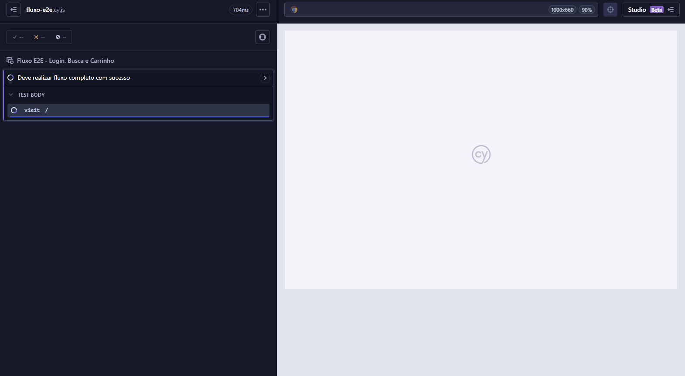

# 🧪 QA Automation Portfolio — Automation Practice

Este repositório faz parte do meu **portfólio como Analista de QA**, contendo **testes automatizados End-to-End (E2E)** desenvolvidos sobre o site:

🔗 **[https://www.automationpratice.com.br](https://automationexercise.com/)**

O objetivo deste projeto é demonstrar, na prática, minhas habilidades em **Qualidade de Software**, desde a organização dos testes até a automação de fluxos críticos de negócio.

[](https://github.com/CarolDominguess/qa-automation-portfolio/actions/workflows/automation.yml)

---

## 🎯 Objetivo do Projeto

- Aplicar conceitos de **QA e testes automatizados**
- Automatizar cenários reais de um sistema web
- Utilizar **boas práticas de automação**
- Criar um projeto organizado e profissional para portfólio
- Demonstrar domínio de ferramentas usadas no mercado

---

## 🧪 Escopo dos Testes Automatizados

Os testes cobrem os principais fluxos do sistema, incluindo:

### 🔐 Login
- Login com credenciais inválidas  
- Validação de mensagens de erro  
- Comportamento esperado em falhas de autenticação  

### 📝 Cadastro de Usuário
- Cadastro com dados válidos  
- Validação de campos obrigatórios  
- Validação de mensagens de erro  

### 🔍 Busca de Produtos
- Busca por produtos existentes  
- Busca sem resultados  
- Validação da listagem retornada  

### 🛒 Carrinho de Compras
- Adicionar produto ao carrinho  
- Remover produto do carrinho  
- Validação de quantidade e valores  

### 💳 Checkout
- Fluxo completo de compra  
- Validação de campos obrigatórios  
- Validação de mensagens de erro no checkout  

---

## 📋 Casos de Teste Automatizados

| ID | Funcionalidade | Cenário | Resultado Esperado |
|----|----------------|---------|--------------------|
| CT-01 | Login | Login com dados válidos | Usuário deve ser autenticado com sucesso |
| CT-02 | Login | Login com senha inválida | Exibir mensagem de erro |
| CT-03 | Cadastro | Criar novo usuário | Conta criada com sucesso |
| CT-04 | Produtos | Buscar produto existente | Produto exibido na lista |
| CT-05 | Carrinho | Adicionar produto ao carrinho | Produto adicionado corretamente |
| CT-06 | Checkout | Finalizar compra | Compra finalizada com sucesso |

---

## 🧱 Estrutura do Projeto

```text
cypress/
├─ e2e/        → Casos de teste automatizados (E2E)
├─ pages/      → Page Objects (mapeamento das telas)
├─ fixtures/   → Massa de dados para os testes
└─ support/    → Configurações e comandos auxiliares

```
---

## ⚙️ Tecnologias Utilizadas

* JavaScript
* Cypress
* Node.js
* Git e GitHub

---

## ▶️ Como Executar o Projeto

### 🔧 Pré-requisitos

* Node.js instalado
* Git instalado

### 📥 Instalar dependências

```bash
npm install
```

### ▶️ Executar testes no modo visual

```bash
npx cypress open
```

### ▶️ Executar testes no modo headless

```bash
npx cypress run
```

---

## 📊 Evidências de Teste

* Screenshots automáticos em caso de falha
* Vídeos de execução dos testes
* Logs detalhados do Cypress

Arquivos grandes (vídeos e screenshots) não são versionados no GitHub, seguindo boas práticas.

---

## 📚 Aprendizados Aplicados

* Testes End-to-End (E2E)
* Boas práticas de automação
* Organização de testes com Page Objects
* Versionamento com Git
* Estruturação de um portfólio profissional em QA

---

## 🔐 Credenciais de Teste

As credenciais utilizadas nos testes positivos estão definidas diretamente nos arquivos de teste para fins demonstrativos, pois o sistema testado é público e destinado a testes.

Em ambientes reais, essas informações devem ser armazenadas em variáveis de ambiente.


---

## 👩‍💻 Autora

**Ana Carolina Domingues**

🎯 Analista de QA em formação

🔗 GitHub: [https://github.com/CarolDominguess](https://github.com/CarolDominguess)

## 🎥 Execução dos Testes




